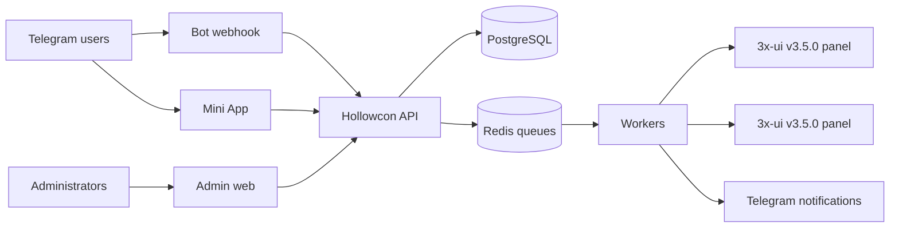

# Architecture

PostgreSQL is authoritative for commerce state. An order approval transaction records the review and emits an outbox event. Durable workers provision deterministic clients through one chosen panel, verify the result, and then mark delivery complete. Retries reuse the same idempotency identity.

External systems are adapters. The domain package does not depend on Telegram, 3x-ui, PostgreSQL, Redis, or UI frameworks.
